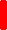
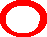
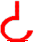

# Polyspear

**Gra turowa, umiejscowiona na planszy heksagonalnej. W której dwóch graczy naprzemiennie przesuwa jednostki w celu zabicia drużyny przeciwnej.**

Gra utworzona została w ramach projektów kołowych na KNTG poligon, semestr 2018Z

## Autorzy ##
+ @​Młody - pomysł, mechaniki gry, grafika
+ @​bartek7777 - programowanie
+ @​manofmans - programowania
+ @​Ku Ku - muzyka i dźwięki

Należy podkreślić, że w obecnej wersji gra cechuje się ograniczoną funkcjonalnością. Reprezentuje ona podstawowe mechaniki trybu bitewnego, ale nie zawiera całego zbioru planowanych rozwiązań.

Jednostkę reprezentuje sześcioboczny „żeton” przedstawiający rysunek jednostki oraz zestaw symboli na poszczególnych bokach.

###### Obrót i Ruch  ######
Mechanika poruszania się jednostek po polu bitwy. Najpierw gracz wybiera przyległe *dostępne (wolne)* pole a żeton zostaje obrócony w kierunku ruchu.
Sam obrót (nawet w przypadku gdy jednostka już wcześniej była obrócona w kierunku ruchu to i tak ten moment jest traktowany jako faza obrotu.

###### Wolne Pole  ######
Jest to każde pole niebędące: końcem mapy, przeszkodą terenową, sojuszniczą jednostką. Pole z przeciwnikiem traktujemy jako wolne, jeżeli ruch, będzie skutkował usunięciem bądź przesunięciem wroga.

###### Symbole  ######
Główna mechanika gry reprezentująca umiejętności jednostki w walce. Symbol zawsze jest umieszczony na poszczególnym boku oznaczającym kierunek.
Symbole dzielimy na dwa rodzaje: *Pasywne* (działają w każdym momencie) i *Aktywne* (aktywują się podczas: *Obrotu* i *ruchu*). Działanie symbolu nazywane jest *efektem*.
Efekty działają w dwóch stanach: pasywnym i aktywnym.
Kiedy jednostka stoi nieruchomo, jej efekty są w stanie pasywnym. Część efektów działa jedynie w stanie pasywnym. Efekty działają na przyległe pola wskazane przez symbol przy określonym boku. 
###### Efekty  ######
Efekty aktywne aktywowane zostają podczas ruchu dwukrotnie: pierwszy raz w momencie, gdy jednostka obraca się w kierunku ruchu i drugi raz momencie przejścia na dane pole.
	Kiedy jednostka się obraca, przed jej efektami najpierw aktywują się efekty działające na jej pole.

Gracze naprzemiennie wykonują swoje tury, aż jedna ze stron nie będzie miała jednostek. Strona ta przegrywa, a jej przeciwnik odnosi zwycięstwo.

###### Zaimplementowane efekty ######
+  **Włócznia** w stanie akrywnym i pasywnym zabija każdą jednostkę znajdującą się na przyległym boku.
+  **Miecz** w stanie aktywnym zabija każdą jednostkę na przyległym boku. 
+  **Tarcza** blokuje obrażenie (zniszczenie jednostki) od strony tarczy. 
+  **Łuk** w stanie aktywnym wystrzeliwuje pocisk który porusza się w linii prostej i po natrafieniu na wroga nieosłoniętego tarczą zabija go i kończy swój “lot”.
+  **Topór** w stanie aktywnym wystrzeliwuje pocisk który porusza się w linii prostej **na odległość najwyżej dwóch pól** i po natrafieniu na wroga nieosłoniętego tarczą zabija go i kończy swój “lot”.
+  **Odepchnięcie** ignorując tarcze, aktywnie *odpycha* (przesuwa w kierunku naprzeciwległy od jednostki aktywnej) wrogie jednostki. Jeżeli taka jednostka natrafi na dowolne zajęte pole lub kraniec mapy, to umiera.
+  **Hak** - jeżeli 
+ + wroga jednostka znajduje się w odległości od dwóch do trzech pól
+ + pola między nią a postacią aktywną są puste
+  to postać zostaje przesunięta do pola sąsiedniego w stosunku do jednostki aktywnej. Pozwolić to może do "nadziania" wrogiej jednostki na np włócznie.
  
###### Magia ######
todo opisać
